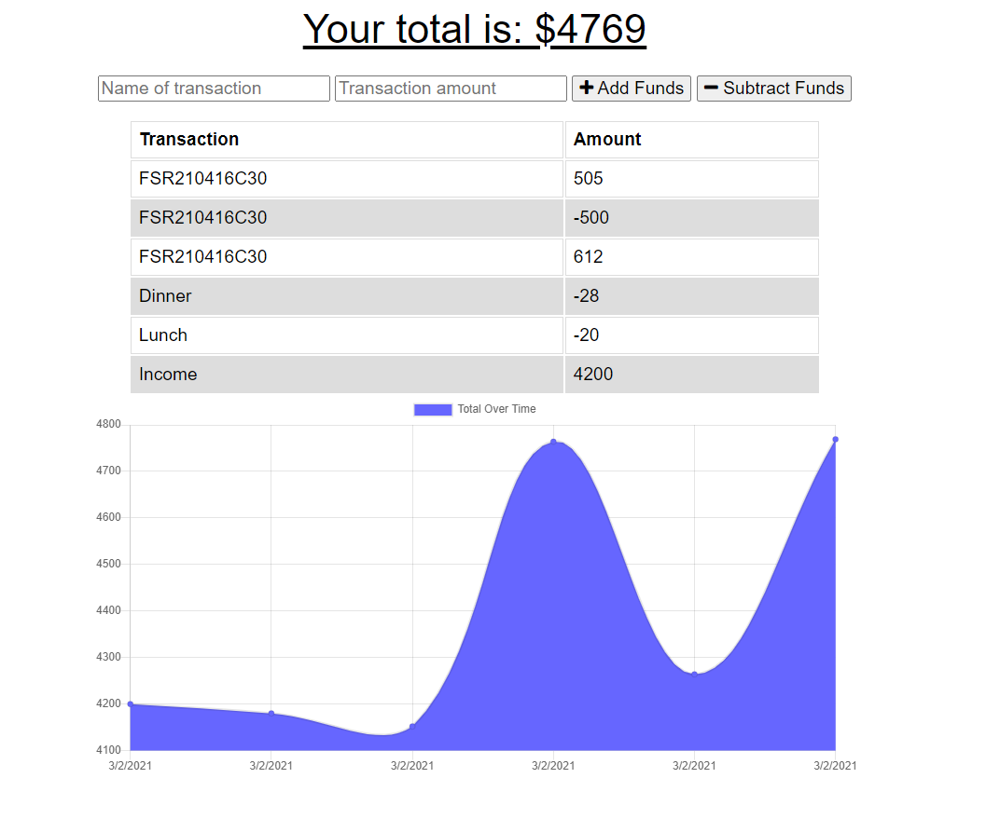

# budget-app


## Description

Budget-App allows for offline access and functionality to reliably keep the budget on track. Expenses and deposits can be added with or without an internet connection. 

When transactions are entered offline, they will populate the total once online again.

<a href="https://dry-caverns-42087.herokuapp.com/" target="_blank"></a>

## Content

* [GitHub Repository](https://github.com/Rudy-Menjivar/budget-app/)

* [Heroku Site](https://dry-caverns-42087.herokuapp.com/)

* [Installation](#installation)

* [Deployment](#Deployment)

* [Usage](#usage)

* [Contributing](#contributing)

* [Tests](#tests)

* [Questions](#questions)


## Installation

Run the following command to install the required dependencies:
```
npm i
```


## Deployment

Deployment involves creating a database with MongoDB Atlas and hosting the site with Heroku.

### Create your database

Navigate to the [MongoDB Atlas dashboard](https://cloud.mongodb.com) to manage your database.

1. First, select **Clusters** and create a new cluster if one hasn't been created yet.

2. Then, create your database by selecting **Collections** and select **Create Database**.

3. Name your database as well as your collection and create it

4. Select **Clusters** again, select **Connect** and select **Connect your application**

5. Copy your connection string, then enter your database user/admin, replace the <password> with your password, *myFirstDatabase* with your database name

* Save your connection string to enter it as the **Value** within Heroku's settings (more on that shortly)

## Usage

Run this command to invoke this application:
```
npm run start
```


## Contributing
    
Any community contributions will help in achieving this project's success, so any help is greatly appreciated.
    
To participate in this project, please review the following guidelines:
    
1. Create a branch for your update (after forking and cloning)
    
   `git checkout -b <branchName>`
    
2. Make changes or additions to new or existing file & stage it
    
   `git add <fileName.ext>`
    
3. Commit your file by adding comments about code enhancements
    
   `git commmit -m <your code comments>`
    
4. Push your changes with your remote branch name
    
   `git push -u origin <branchName>`
    
5. Finally, submit [feature requests and bugs](https://github.com/Rudy-Menjivar/budget-app/issues) and open a [pull request](https://github.com/Rudy-Menjivar/budget-app/pulls)
    

## Tests
    
For testing, run this command:
```
npm run test
```
  

## License

Copyright (c) Rudy-Menjivar. All rights reserved.
    
Licensed under the [MIT](./LICENSE.txt) license.
  

## Questions

If you have any questions then feel free to contact me, and you can find my complete work at GitHub.

* <a href="mailto:rudy.menjivar@gmail.com">Email</a>
* <a href="https://github.com/Rudy-Menjivar" target="_blank">GitHub</a>